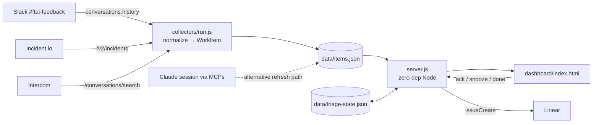

# Support Escalations Dashboard (POC)

One view over the three streams that produce support work for FastTrack AI:

| Stream | What it carries | API used |
|--------|-----------------|----------|
| Slack `#ftai-feedback` | Feedback / requests from partner managers | `conversations.history` |
| Incident.io | Incidents (alerts, queue buildups, Intercom-escalated) | `GET /v2/incidents` |
| Intercom | Client-raised tickets ("something's not working") | `POST /conversations/search` |

Everything is normalized into one **WorkItem** schema so the dashboard can show a
unified queue, severity/SLA state, and per-stream inflow.



## Quick start (sample data, no tokens needed)

```bash
cd support-escalations-dashboard
node server.js
# open http://localhost:8080/
```

## Triage actions

The streams are read-only; the dashboard is not. Each open item has **Ack**,
**Snooze 24h**, **Done**, and **→ Linear** (creates a real Linear issue when
`LINEAR_API_KEY` + `LINEAR_TEAM_ID` are set). Actions persist to
`data/triage-state.json` as an overlay — done/snoozed items leave the open
counts, acked items leave "Needs triage", and every chart reacts. This overlay
is also the done-signal Slack messages otherwise lack.

Serving the folder statically (`python3 -m http.server`) still works but is
read-only — the action column only appears under `server.js`.

`data/sample-items.json` is a real snapshot (47 items) pulled 2026-07-03 from all
three sources via MCPs. Customer email addresses were stripped; brand names kept.

## Live data (API mode)

```bash
export SLACK_BOT_TOKEN=xoxb-...          # scopes: channels:history
export INCIDENT_IO_API_KEY=...
export INTERCOM_ACCESS_TOKEN=...         # EU workspace: also INTERCOM_API_BASE=https://api.eu.intercom.io
node collectors/run.js                   # writes data/items.json (Node 18+)
```

The dashboard prefers `data/items.json` and falls back to the sample. A collector
with a missing token is skipped, so partial refreshes work.

## Live data (MCP mode)

In a Claude session with the Slack / incident.io / Intercom MCPs connected, ask
Claude to refresh `data/items.json` in the WorkItem schema — that's how the
sample snapshot was produced. No tokens leave the MCP layer.

## WorkItem schema

```json
{
  "id": "inc-12204",
  "source": "slack | incident_io | intercom",
  "title": "llm-agent transient 'socket hang up' — supabets",
  "type": "incident | ticket | feedback | bug | request | question",
  "status": "Open | Triage | Investigating | Monitoring | Closed | ...",
  "status_category": "triage | active | closed",
  "severity": "P1 | P2 | P3 | null",
  "brand": "supabets | null",
  "author": "reporter name | null",
  "created_at": "2026-07-03T13:34:55Z",
  "updated_at": "2026-07-03T13:36:09Z",
  "url": "deep link back to the source system",
  "sla_status": "missed | hit | active | null   (Intercom only)"
}
```

## What the dashboard shows

- **Stat tiles** — open items, SLA-missed count, P1/P2 open, oldest open item
- **Open work by stream** — where the load is right now
- **Open by severity** — P1/P2/P3 vs unclassified
- **Inflow (21 days)** — daily new items stacked by stream
- **Unified work-item table** — open first, newest first, deep links to source

Stream filter chips at the top apply to every tile, chart, and the table.

## Deploying it

```bash
docker build -t escalations-dashboard .
docker run -p 8080:8080 \
  -v esc-data:/app/data \
  -e BASIC_AUTH=team:changeme \
  -e SLACK_BOT_TOKEN=... -e INCIDENT_IO_API_KEY=... -e INTERCOM_ACCESS_TOKEN=... \
  -e LINEAR_API_KEY=... -e LINEAR_TEAM_ID=... \
  escalations-dashboard
```

Single container, all config via env vars, state on one volume. `BASIC_AUTH`
gates everything — do not expose it without it. Refresh live data with
`curl -X POST localhost:8080/api/refresh` (cron it, or hit it from a Claude
routine).

## POC limitations (deliberate)

- No history — each refresh overwrites `items.json`; trends beyond created_at
  need a store (SQLite would do). Triage state does persist across refreshes.
- Triage state is local to the dashboard — a Done here does not close the
  Intercom ticket or incident (one-way for now; write-backs are the next step).
- Basic auth + JSON-file state is fine for a single small team, not beyond.
- Slack collector returns user IDs, not names (needs `users.info` lookup).
- No dedup across streams — an Intercom ticket escalated to Incident.io shows
  twice (INC-12206 ↔ its Intercom conversation). Real version should link them
  via the Intercom URL already present in incident summaries.
- Severity for Slack items is unknowable without classification — an LLM pass
  could assign type/severity/brand from message text.
